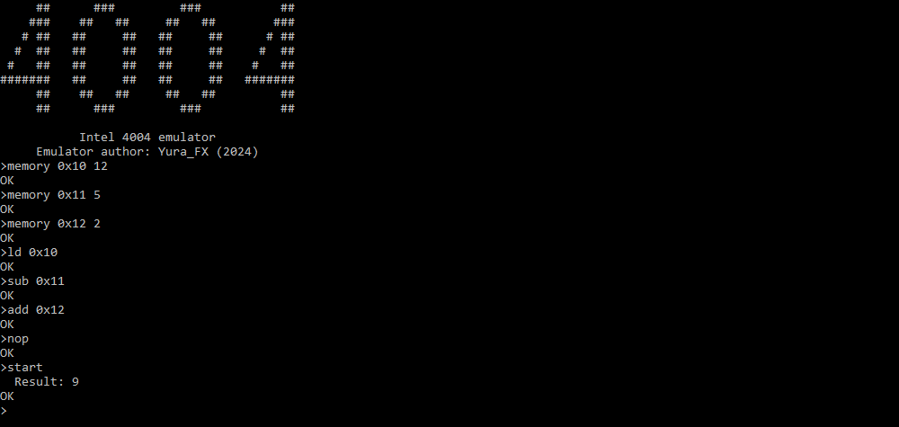

<h1 align="center">Intel 4004 emulator</h1>

 [Financial support](https://www.donationalerts.com/r/yura_fx)

## Introduction

In September 2023, I decided to sign up for Future Code in order to gain knowledge of the Python language. Alas, after a very long period of time (until October), 
after filling out all the paperwork and so on, we were told that because of two, pardon the expression, morons who didn't get something and somewhere 
in time to fill out and pass, had to cancel this program in my technical school. I was not really upset, on the contrary, it even gave me a good impetus. 
to learn this programming language on my own at home, as I did with all previous languages :) My last projects were 
video games, so this time I decided to write something more serious, namely a CPU emulator, specifically [Intel 4004](https://en.wikipedia.org/wiki/Intel_4004) with very reduced functionality. 
Bottom line: I got it all (not at once), but it worked and I want to share this creation with you, dear comrades!

As of April 2024, the emulator has been rewritten from scratch and is currently under active development.

## About the emulator

The emulator has 256 bytes of memory into which program results are stored.

There is the Accumulator (acc), a processor register in which the results of arithmetic and logical instructions are stored, 
program counter (pc), a processor register that indicates which instruction to execute next, and a carry flag (carry) that indicates 
the occurrence of a one as a result of an arithmetic operation.

An opcode, a piece of machine language called an instruction that defines the operation that to be performed. 
Here is a table of opcodes and their corresponding operation:

|Opcode|Operation                                                               |
|------|------------------------------------------------------------------------|
|`0x0` |No Operation                                                            |
|`0x1` |Jump conditional                                                        |
|`0x2` |Fetched immediate from ROM                                              |
|`0x3` |Fetch indirect from ROM                                                 |
|`0x3(1)` |Jump indirect                                                        |
|`0x4` |Jump unconditional                                                      |
|`0x5` |Jump to Subroutine                                                      |
|`0x6` |Increment index register                                                |
|`0x7` |Increment index register skip if zero                                   |
|`0x8` |Add index register to accumulator with carry                            |
|`0x9` |Subtract index register to accumulator with borrow                      |
|`0xA` |Load index register to Accumulator                                      |
|`0xB` |Exchange index register and accumulator                                 |
|`0xC` |Branch back and load data to the accumulator                            |
|`0xD` |Load Data to Accumulator                                                |
|`0xF0`|Clear both                                                              |
|`0xF1`|Clear carry                                                             |
|`0xF2`|Increment accumulator                                                   |
|`0xF3`|Complement carry                                                        |
|`0xF4`|Complement Accumulator                                                  |
|`0xF5`|Rotate left                                                             |
|`0xF6`|Rotate right                                                            |
|`0xF7`|Transmit carry and clear                                                |
|`0xF8`|decrement accumulator                                                   |
|`0xF9`|Transfer carry subtract                                                 |
|`0xFA`|Set carry                                                               |
|`0xFB`|Decimal adjust accumulator                                              |

### How is the program set up?

Here is an example program where the number 5 is subtracted from the number 12 and then the number 2 is added:

## Additional material

[Intel 4004 datasheet](https://archive.org/download/intel-4004/intel-4004.pdf)

## Installation

[Download](https://github.com/YuraFX/i4004-py/releases/tag/1.0) Windows version in release.

## About license

This program is [free software](https://www.gnu.org/philosophy/free-sw.en.html): you can redistribute it and/or modify it under the terms of the [GNU General Public License](https://www.gnu.org/licenses/gpl-3.0.en.html) as published by the [Free Software Foundation](https://www.fsf.org/), either version 3 of the License, or (at your option) any later version.

This program is distributed in the hope that it will be useful, but WITHOUT ANY WARRANTY; without even the implied warranty of MERCHANTABILITY or FITNESS FOR A PARTICULAR PURPOSE. See the GNU General Public License for more details.

You should have received a [copy](https://github.com/YuraFX/i4004-py/blob/main/LICENSE) of the GNU General Public License along with this program. If not, see [https://www.gnu.org/licenses/](https://www.gnu.org/licenses/licenses.en.html).
